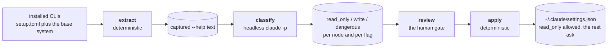

# CLI permission allowlist

Claude Code (and similar agent harnesses) prompt for approval on most Bash commands. Most of what
gets run in a typical session is safe — inspecting, listing, describing — and approving the same
`kubectl get`/`git log`/`docker ps` shape of command over and over is pure friction. The fix isn't a
hand-written list of "safe commands" (stale the moment a tool updates, and nobody keeps it in sync)
— it's a small pipeline that regenerates the list from what's actually installed, classifies it with
an LLM instead of guessing, and keeps a human in the loop before anything gets trusted.

That pipeline lives in `cli-allowlist/` (tracked in git — this is original derived project config,
not vendor material) and `tasks/allowlist.py` (`inv allowlist.*`).

## Architecture: extract → classify → review → apply



`extract` is skipped for a tool whose `--version` has not changed, and `classify` for a node whose
help text has not changed, which is what makes a routine re-run nearly free.

```
inv allowlist.extract   deterministic, no LLM      captures --help text, recursing into the
                                                    subcommand tree where a tool opts in
inv allowlist.classify  LLM (headless claude -p)    read_only / write / dangerous per node, plus
                                                    per-flag ratings for risk-relevant options
inv allowlist.review    human gate                  you look at what changed, mark it reviewed
inv allowlist.apply     deterministic, no LLM       merges reviewed rules into ~/.claude/settings.json
```

Each stage is independently re-runnable and cheap to re-run when nothing changed — that's the point.
`extract` is skipped per-tool when `--version` output hasn't changed; `classify` is skipped per-node
when that node's own help text hasn't changed; `apply` is a no-op when the computed rule set already
matches what's live. A routine re-run after `apt upgrade` costs close to nothing and makes zero LLM
calls unless a tool's actual command surface changed.

Coverage isn't limited to what `setup.toml` installs — it also includes the base system (coreutils,
util-linux, diffutils, procps, tar/gzip/bzip2/xz), so an agent reaching for `cat`/`cp`/`rm`/`dd` is
covered just as much as anything PULSE explicitly installs.

Both `write` and `dangerous` classifications render as `ask` rules, never `deny` — you always still
get a real, interactively-approvable prompt for anything risky; only genuinely safe, read-only
commands get pre-approved.

## One source, one rendering per harness

The pipeline never writes a harness's own rule syntax by hand. Classifications and the hand-picked
overrides in `cli-allowlist/tools.toml` become harness-neutral rules (`tasks/permission_rules.py`),
and each harness gets a renderer that spells them as precisely as that harness allows. The harnesses
genuinely disagree: Copilot takes regular expressions and can say "exactly one argument"; Claude
Code's `*` matches any text, spaces included, and it warns at startup about some shapes. So a rule
like "`git -C <repo> status`" is one precise regex for Copilot and no rule at all for Claude, whose
syntax can't say it safely — Claude Code's Bash sandbox is what lets those cross-repo reads run.
This is also where a harness changing its matching gets absorbed: a new release costs a renderer
change, not a rewrite of the rule list.

Every Bash command rule lives there, including the hand-written ones for `inv` and `spowse`.
`setup.toml` keeps only Claude settings that aren't command rules (file read grants and the like).

## Operating it

```shell
# after installing a new tool, or periodically (e.g. after apt upgrade):
inv allowlist.extract
inv allowlist.classify
inv allowlist.reconfirm   # resolve needs_review items with their specific flagged word in context
inv allowlist.review      # look at what's new/changed, approve it
inv allowlist.apply       # merge into ~/.claude/settings.json

inv allowlist.status                        # what's tracked, stale, or still unreviewed
inv allowlist.check-coverage                # every node-with-children's child has its own rule
inv allowlist.check-claude                  # live: does the installed Claude Code read the rules right?
inv allowlist.render --target=copilot       # Copilot's format instead — still print-only, no apply yet
inv allowlist.check-man-deps                # re-check for new man-page dependencies
```

**Run `inv allowlist.check-claude` after every Claude Code upgrade**, and after changing an override
in `tools.toml`. It loads the exact rule set `apply` would write into a real `claude -p` (Haiku,
about five cents), runs a fixed table of commands in throwaway repositories, and fails on any
permission-rule warning, on any command that runs when it should prompt or the reverse, and on
Claude refusing the settings outright. The unit suite cannot see any of those, because they are
facts about the installed binary.

`apply` only ever touches the `permissions` block of `~/.claude/settings.json` — everything else
(`theme`, `effortLevel`, ...) is read, kept, and written back unchanged. It refuses to write past 1
MiB, half the 2 MiB beyond which Claude Code rejects the whole file. Copilot support
(`render --target=copilot`) is print-only today — copy its output into your own Copilot config by
hand, there's no `apply` equivalent yet.

Adding a custom tool to the pipeline (or extending recursion into a tool's subcommand tree) is done
by editing `cli-allowlist/tools.toml`, then re-running `extract`/`classify`/`review`/`apply`.

## See also

- [Claude Code](claude-code.md) — the settings file these rules are merged into
- [AI tools](ai.md) — what PULSE does for agents generally
- [Task index](tasks.md) — the `allowlist.*` tasks in one place
