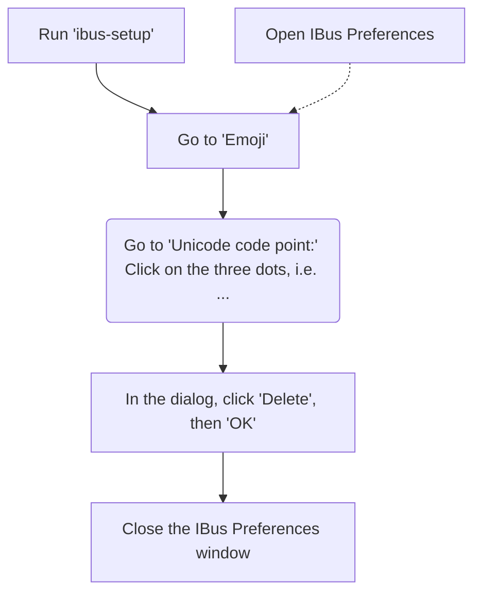

# Installation steps

This is intended for and has been tested on Ubuntu 24.04 noble numbat.

!!! IMPORTANT
    Paste the code copied from this guide in the terminal using ++Ctrl+Shift+V++.

!!! TODO
    Put all scripts into shell files and include them via mkdocs snippet.
    Inlcude the following for all to ensure they fail fast:

    ```shell
    # disabled -u for unset variables due to weird behavior 
    set -ex -o pipefail
    ```

## Grub

!!! WARNING
    Perform only if you gave problems booting due to graphics drivers.

This is useful to prevent graphic driver issues, since the OS makes
assumptions and changes to video resolution before loading the GUI.

This basically removes `quiet` and `splash` while adding `nomodeset`.
The only downside is cosmetic, i.e. no splash screen and verbose output.

```shell
sudo sed -i \
  's~GRUB_CMDLINE_LINUX_DEFAULT=.*~GRUB_CMDLINE_LINUX_DEFAULT="nomodeset"~' \
  /etc/default/grub
sudo update-grub
```

## Swap

!!! INFO
    Nothing to do here yet, only pending research.

Reference articles:
[Part 1](https://haydenjames.io/linux-performance-almost-always-add-swap-space/)
[Part 2](https://haydenjames.io/linux-performance-almost-always-add-swap-part2-zram/)

## Apt Packages - tools and prerequisites

Follow the [guide](apt_packages.md).

## Networking

Follow the [guide](networking.md).

## Gnome extensions

Follow the [guide](gnome_extensions.md).

## Fonts

Follow the [guide](fonts.md).

## Terminal

We strongly recommend using `terminator`, which should replace the native terminal
and be available via the ++Ctrl+Alt+T++ shortcut.

To set the color of the title bar from red to something less tiring:

```shell
tee ${HOME}/.config/terminator/config > /dev/null <<EOF
[profiles]
  [[default]]
    title_transmit_bg_color = "#613583"
EOF
```

### NyanCat for terminal, an absolute must

!!! TODO
    See what the correct install dir for this should be, likely in .local

```shell
NYANCAT_INSTALL_DIR="${HOME}/.nyancat"
git clone "https://github.com/klange/nyancat.git" "${NYANCAT_INSTALL_DIR}"
make -C "${NYANCAT_INSTALL_DIR}"
ln -s -f "${NYANCAT_INSTALL_DIR}/src/nyancat" "${HOME}/.local/bin/nyancat"
```

## Shell: Zsh + Oh My Zsh + PowerLevel10k

Follow the [guide](zsh.md).

## Languages and tool chains

!!! WARNING
    Every language is optional based on your project needs and inclinations.

### Python

Follow the [guide](python.md).

### Golang

Follow the [guide](golang.md).

### Java

!!! TODO
    Implement.

#### Scala

```shell
SCALA_CLI_SETUP="$(mktemp)"
curl -sS -L -f "https://github.com/coursier/launchers/raw/master/cs-x86_64-pc-linux.gz" \
  | gzip -d > "${SCALA_CLI_SETUP}"
chmod +x "${SCALA_CLI_SETUP}"
"${SCALA_CLI_SETUP}" setup
rm "${SCALA_CLI_SETUP}"

# TODO: put java home in .zshrc
# get java home, enter for the Metals extension in VS Code in settings 
cs java -XshowSettings:properties -version 2>&1 | grep "java.home" | sed 's/.*= *//'
```

### Rust

<https://www.rust-lang.org/tools/install>

## SSH

Follow the [guide](ssh.md).

## Source control

### Git

Follow the [guide](git.md).

### Github

Follow the [guide](github.md).

## Docker

Follow the [guide](docker.md).

## Browsing

### Google Chrome

```shell
CHROME_DEB="$(mktemp)"
CHROME_URL="https://dl.google.com/linux/direct/google-chrome-stable_current_amd64.deb"
curl -sS -L -o "${CHROME_DEB}" "${CHROME_URL}"
sudo dpkg -i "${CHROME_DEB}"
rm -v -f "${CHROME_DEB}"
```

### Microsoft Edge

```shell

# curl -sS -L -f https://packages.microsoft.com/keys/microsoft.asc | sudo apt-key add -
curl -sS -L -f https://packages.microsoft.com/keys/microsoft.asc \
  | sudo gpg --dearmor -o /etc/apt/keyrings/microsoft.gpg
sudo add-apt-repository -y "deb [arch=amd64] https://packages.microsoft.com/repos/edge stable main"
sudo apt update
sudo apt install -y microsoft-edge-stable
```

## Communication

### Slack

!!! WARNING
    Optional.

```shell
sudo snap install --classic slack
```

## Teams

Use this from the browser. Do not install anything, all versions are outdated and Microsoft advises to use the web app.

## Software Development

### Visual Studio Code

<https://code.visualstudio.com/docs/setup/linux>

```shell
sudo snap install --classic code
```

### Pycharm

<https://www.jetbrains.com/help/pycharm/installation-guide.html#snap>

Depending on your license choice:

```shell
sudo snap install --classic pycharm-professional
```

or:

```shell
sudo snap install --classic pycharm-community
```

## Media

### Spotify

```shell
sudo snap install spotify
```

## File management

### Double Commander

```shell
sudo apt install -y doublecmd-gtk
```

!!! TODO
    Add config

## Benchmarking

### Hyperfine

```shell
HYPERFINE_DEB="$(mktemp)"
HYPERFINE_REPO_URL="https://api.github.com/repos/sharkdp/hyperfine/releases/latest"
HYPERFINE_URL=$(
  curl -sS -L "${HYPERFINE_REPO_URL}" \
    | grep 'browser_download_url.*hyperfine_.*amd64\.deb' \
    | sed -E 's/.*"([^"]+)"\s*$/\1/' \
)
curl -sS -L -o "${HYPERFINE_DEB}" "${HYPERFINE_URL}"
sudo dpkg -i "${HYPERFINE_DEB}"
rm "${HYPERFINE_DEB}"
```

### Disable Ctr-Shift-U system shortcut

<https://superuser.com/questions/358749/how-to-disable-ctrlshiftu-in-ubuntu-linux>

Problem

The problem is that with the "Ibus" input method, ++ctrl+shift+u++
is by default configured to the "Unicode Code Point" shortcut.

You can try this: Type ++ctrl+shift+u++, then an (underlined) u appears.
If you then type a unicode code point number in hex
(e.g. 21, the ASCII/unicode CP for !) and press enter,
it is replaced with the corresponding character.

Check if this is set:

```shell
gsettings get org.freedesktop.ibus.panel.emoji unicode-hotkey
```

Set it to something else:

```shell
gsettings set org.freedesktop.ibus.panel.emoji unicode-hotkey "['<Control><Super><Shift>u']"
```

If the shell command fails, this shortcut can be changed or disabled using the ibus-setup utility:



## Autostart

!!! WARNING
    Optional.

```shell
USER_AUTOSTART_DIR="${HOME}/.config/autostart"
APT_AUTOSTART_APPS=( \
  # doublecmd \
  terminator \
  google-chrome \
)
for app in "${APT_AUTOSTART_APPS[@]}"; do
  cp -v "/usr/share/applications/${app}.desktop" "${USER_AUTOSTART_DIR}"
done
SNAP_AUTOSTART_APPS=( \
    pycharm-professional_pycharm-professional \
    spotify_spotify \
)
for app in "${SNAP_AUTOSTART_APPS[@]}"; do
  cp -v "/var/lib/snapd/desktop/applications/${app}.desktop" "${USER_AUTOSTART_DIR}"
done
```

Sample `.desktop` file creation:

```shell
tee -a ${HOME}/.config/autostart/cisco_anyconnect.desktop > /dev/null <<EOF
[Desktop Entry]
Type=Application
Name=Cisco Anyconnect Secure Mobility Client
Comment=Connect to a private network using the Cisco Anyconnect Secure Mobility Client
Exec=/opt/cisco/anyconnect/bin/vpnui
Icon=cisco-anyconnect
Terminal=false
Encoding=UTF-8
StartupNotify=true
EOF
```

## UI

!!! TODO
    Add favorite apps to task bar and remove default ones