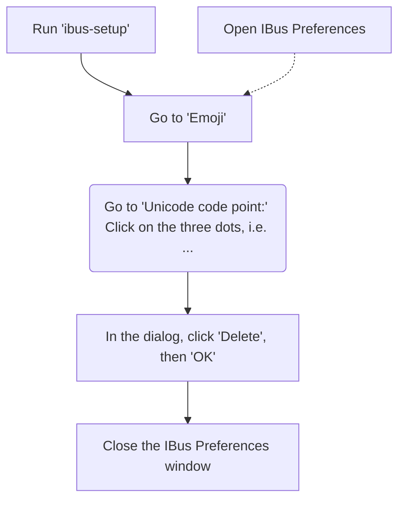

# Installation steps

This is intended for and has been tested on Ubuntu 20.04 focal fossa.

```shell
# disabled -u for unset variables due to weird behavior 
set -ex -o pipefail
```

## Apt Packages - tools and prerequisites

Follow the [guide](apt_packages.md).

## Gnome extensions

Follow the [guide](gnome_extensions.md).

## Fonts

Follow the [guide](fonts.md).

## Zsh + Oh My Zsh + PowerLevel10k

Follow the [guide](zsh.md).

### NyanCat for terminal, an absolute must

```shell
NYANCAT_INSTALL_DIR="${HOME}/.nyancat"
git clone "https://github.com/klange/nyancat.git" "${NYANCAT_INSTALL_DIR}"
make -C "${NYANCAT_INSTALL_DIR}"
ln -s -f "${NYANCAT_INSTALL_DIR}/src/nyancat" "${HOME}/.local/bin/nyancat"
```

## Python tools

Follow the [guide](python.md).

## Golang

Follow the [guide](golang.md).

## SSH

Follow the [guide](ssh.md).

## Git

Follow the [guide](git.md).

## Docker

Follow the [guide](docker.md).

## Networking

Set up DNS with Cloudflare IPs.

```shell
sudo tee "/etc/resolvconf/resolv.conf.d/tail" >/dev/null <<EOF
nameserver 1.1.1.1
nameserver 1.0.0.1
EOF
sudo resolvconf -u
# verify changes
systemd-resolve --status
```


## Browsing

### Google Chrome

```shell
CHROME_DEB="google-chrome-stable_current_amd64.deb"
CHROME_URL="https://dl.google.com/linux/direct/${CHROME_DEB}"
curl -sS -L -o "/tmp/${CHROME_DEB}" "${CHROME_URL}"
sudo dpkg -i "/tmp/${CHROME_DEB}"
rm "/tmp/${CHROME_DEB}"
```

### Sidekick

!!! TODO
    Resolve repo conflict with Chrome warnings.

```shell
SIDEKICK_DEB="$(mktemp)"
SIDEKICK_URL="https://api.meetsidekick.com/downloads/df/linux/deb"
curl -sS -L -o "${SIDEKICK_DEB}" "${SIDEKICK_URL}"
sudo dpkg -i "${SIDEKICK_DEB}"
rm -f "${SIDEKICK_DEB}"
```

## Communication

### Franz

!!! WARNING
    Skip this if using Sidekick (recommended).


```shell
# TODO: get latest version automatically
FRANZ_DEB="franz_5.4.1_amd64.deb"
FRANZ_URL="https://github.com/meetfranz/franz/releases/download/v5.4.1/${FRANZ_DEB}"
curl -sS -L -o "/tmp/${FRANZ_DEB}" "${FRANZ_URL}"
sudo dpkg -i "/tmp/${FRANZ_DEB}"
rm "/tmp/${FRANZ_DEB}"
```

### Slack

!!! WARNING
    No longer used in favor of Franz / Sidekick.

```shell
sudo snap install --classic slack
```

## Software Development

### Visual Studio Code

```shell
sudo snap install --classic code
```

### Pycharm Professional

```shell
sudo snap install --classic pycharm-professional
```

### Notepad++

!!! WARNING
    Not working properly.

```shell
sudo snap install notepad-plus-plus
```

#### Alternative - Notepadqq

!!! WARNING
    Untested.

!!! TODO
    install, test, document

```shell
sudo snap install notepadqq
```

## Media

### Spotify

```shell
sudo snap install spotify
```

## File management

### Double Commander

```shell
sudo apt install -y doublecmd-gtk
```

## Email

### Evolution

!!! TODO
    install, test, document

!!! WARNING
    VERY OLD

```shell
# !!! repo doesn't work, needs to be specified with older ubuntu release name !!!
# sudo add-apt-repository ppa:fta/gnome3
# sudo apt update
# sudo apt install -y evolution
```

### Thunderbird

!!! TODO
    configure, document

## Autostart

```shell
USER_AUTOSTART_DIR="${HOME}/.config/autostart"
APT_AUTOSTART_APPS=( \
  # doublecmd \
  terminator \
  google-chrome \
  sidekick-browser \
)
for app in "${APT_AUTOSTART_APPS[@]}"; do
  cp -v "/usr/share/applications/${app}.desktop" "${USER_AUTOSTART_DIR}"
done
SNAP_AUTOSTART_APPS=( \
    pycharm-professional_pycharm-professional \
    spotify_spotify \
)
for app in "${SNAP_AUTOSTART_APPS[@]}"; do
  cp -v "/var/lib/snapd/desktop/applications/${app}.desktop" "${USER_AUTOSTART_DIR}"
done
```

Sample `.desktop` file creation:

```shell
tee -a ${HOME}/.config/autostart/cisco_anyconnect.desktop > /dev/null <<EOF
[Desktop Entry]
Type=Application
Name=Cisco Anyconnect Secure Mobility Client
Comment=Connect to a private network using the Cisco Anyconnect Secure Mobility Client
Exec=/opt/cisco/anyconnect/bin/vpnui
Icon=cisco-anyconnect
Terminal=false
Encoding=UTF-8
StartupNotify=true
EOF
```

## UI

!!! TODO
    Add favorite apps to task bar and remove default ones

## Benchmarking

### Hyperfine

```shell
HYPERFINE_DEB="$(mktemp)"
HYPERFINE_REPO_URL="https://api.github.com/repos/sharkdp/hyperfine/releases/latest"
HYPERFINE_URL=$(
  curl -sSL "${HYPERFINE_REPO_URL}" \
    | grep 'browser_download_url.*hyperfine_.*amd64\.deb' \
    | sed -E 's/.*"([^"]+)"\s*$/\1/' \
)
curl -sS -L -o "${HYPERFINE_DEB}" "${HYPERFINE_URL}"
sudo dpkg -i "${HYPERFINE_DEB}"
rm "${HYPERFINE_DEB}"
```

## Fix CRLF

```shell
# find . -type f | xargs file -k -- | grep CRLF | wc -l
# find . -type f | xargs dos2unix
# chmod go-w -R *
# sudo find . -type f | xargs chmod a-x
```

### Disable Ctr-Shift-U system shortcut

!!! TODO
    test

<https://superuser.com/questions/358749/how-to-disable-ctrlshiftu-in-ubuntu-linux>

Problem

The problem is that with the "Ibus" input method, ++ctrl+shift+u++
is by default configured to the "Unicode Code Point" shortcut.

You can try this: Type ++ctrl+shift+u++, then an (underlined) u appears.
If you then type a unicode code point number in hex
(e.g. 21, the ASCII/unicode CP for !) and press enter,
it is replaced with the corresponding character.

This shortcut can be changed or disabled using the ibus-setup utility:


