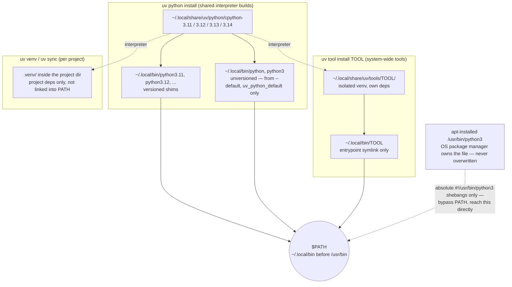

# Python

All Python version management, tool installs, and virtual environments are handled by
[uv](https://github.com/astral-sh/uv). pyenv, poetry, and pipx are no longer used.

## Bootstrap

Run `bootstrap.sh` from the repo root. It installs uv, then installs and manages all Python versions
defined in `setup.toml`:

```shell
./bootstrap.sh
```

This installs:

- uv itself into `~/.local/bin/uv`
- Python versions via uv — default (`uv_python_default`) plus extras (`uv_python_extra`)
- invoke (the task runner) under the default Python version

To change which versions are installed, edit `setup.toml`:

```toml
[settings]
uv_python_default = "3.14"
uv_python_extra = ["3.11", "3.12", "3.13"]
uv_python_set_default = true
```

Prefer `inv python.set-default <version>` (below) over hand-editing `uv_python_default` — it also
keeps `uv_python_extra` and `[packages.uv-env]`'s `UV_PYTHON` value in sync, both of which otherwise
have to be updated by hand alongside it.

## Python version shims

After bootstrap, uv creates versioned shims in `~/.local/bin` for every installed version:

```
~/.local/bin/python3.11  ->  ~/.local/share/uv/python/cpython-3.11-linux-x86_64-gnu/bin/python3.11
~/.local/bin/python3.14  ->  ...
```

These are available in any shell where `~/.local/bin` precedes `/usr/bin` on `PATH`.

`bootstrap.sh` also passes `--default` to `uv python install` for `uv_python_default` (gated by the
`uv_python_set_default` setting, on by default), which makes uv additionally install _unversioned_
`~/.local/bin/python` and `~/.local/bin/python3`, pointing at that same version. This matters
because plain `python` doesn't exist anywhere else on a stock Ubuntu box — apt never ships an
unversioned `python`, and until this was added neither did uv — so anything assuming bare `python`
works (extremely common: it's the only name that exists on Windows, and it's what every
`venv`/`uv venv` creates internally — confirmed via `uv venv`: its `bin/python` is the real symlink
target, `bin/python3`/`bin/python3.X` just point at it) would fail outside an activated venv.

The trade-off: since `~/.local/bin` precedes `/usr/bin` on `PATH`, the unversioned `python3` shim
also shadows apt's own `/usr/bin/python3` — but only for things that resolve `python3` _via_ `PATH`
(an interactive shell, or a script shebanged `#!/usr/bin/env python3`). It does **not** touch
`/usr/bin/python3` itself, and has no effect on the majority of system tooling
(`apt-add-repository`, `unattended-upgrade`, and ~25 others checked on a real Ubuntu 24.04 box),
which hardcodes an absolute `#!/usr/bin/python3` shebang and bypasses `PATH` entirely regardless of
this setting. Set `uv_python_set_default = false` in `setup.toml` to opt back into a fully
system/apt-owned `python`/`python3` and skip the `--default` flag.

## Changing the default Python version

```shell
inv python.set-default 3.14
```

Updates `uv_python_default` in `setup.toml`, moves the old default into `uv_python_extra` (so it
stays installed rather than being dropped), keeps `[packages.uv-env]`'s `UV_PYTHON` value in sync,
installs the new version if it isn't already managed, and re-points the unversioned
`python`/`python3` shims at it (skipped if `uv_python_set_default` is `false`). Run
`inv
zsh.configure` afterward and open a new terminal to pick up the new `UV_PYTHON` shell default.

## Shell default

`UV_PYTHON` is set in `~/.zshenv` automatically by `inv zsh.configure` (or `inv setup`), sourced
from the `[packages.uv-env]` entry in `setup.toml`. Project-level `.python-version` files override
it automatically.

## System-wide tools

All tools are installed as isolated uv-managed executables and defined in `setup.toml` under
`method = "uv-tool"`. Install or upgrade all of them with:

```shell
inv python.install-tools
```

Current tools: `nox`, `mkdocs` (with `mkdocs-material`), `twine`, `glances`, `nuitka`, `zensical`,
`keyring`. (`invoke` itself is installed by `bootstrap.sh`, not this task.)

`mkdocs`/`mkdocs-material` is no longer what builds _this_ repo's docs site (migrated to `zensical`
2026-08-08) but is kept installed system-wide for other projects that still use it.

To add a new tool, add a section to `setup.toml`:

```toml
[packages.mytool]
method = "uv-tool"
package = "mytool"
```

Then run `inv python.install-tools` again.

## Project virtual environments

Create a virtualenv pinned to a specific Python:

```shell
uv venv --python 3.12
```

Pin the project's default Python (writes `.python-version`, committed to the repo):

```shell
uv python pin 3.12
```

From then on, plain `uv venv` and `uv run` in that project automatically use 3.12.

Install project dependencies from a `pyproject.toml` or `requirements.txt`:

```shell
uv sync           # pyproject.toml with [project.dependencies]
uv pip install -r requirements.txt
```

## How the pieces fit together

Three separate things share the `uv`-managed Python builds but never share dependencies with each
other or with the OS:



- **Interpreters** (`uv python install`) are just Python builds — no packages of their own beyond
  the stdlib. Everything else borrows one of these as its interpreter.
- **Tools** (`uv tool install`, driven by `[packages.*] method = "uv-tool"` in `setup.toml`) each
  get a fully isolated venv under `~/.local/share/uv/tools/<name>/`; only the entrypoint script is
  symlinked into `~/.local/bin`, so `zensical`'s dependencies (or `nox`'s, or `twine`'s) can never
  collide with each other or with a project's `.venv`. This is why `~/.local/bin/zensical` is a
  symlink to `~/.local/share/uv/tools/zensical/bin/zensical` rather than a real binary.
- **Project venvs** (`uv venv`, `uv sync`, `uv run`) are scoped to a single project directory and
  are never put on `PATH` directly — you either activate one or prefix commands with `uv run`.
- The **system Python** (`/usr/bin/python3`) file is never overwritten by any of the above. But once
  `uv_python_set_default` installs the unversioned `python`/`python3` shims, they sit ahead of it on
  `PATH` — so anything resolving `python3` _via_ `PATH` (an interactive shell, or a
  `#!/usr/bin/env python3` shebang) reaches uv's build instead. Absolute-shebang system scripts (the
  majority) bypass `PATH` entirely and always reach `/usr/bin/python3` directly, regardless of this
  setting.

## Private PyPI

If using a private package index, configure it via environment variable or `uv.toml`:

```shell
# environment variable (e.g. in .env or shell profile)
export UV_INDEX_URL="https://your-private-pypi/simple"
export UV_EXTRA_INDEX_URL="https://pypi.org/simple"
```

Or in `~/.config/uv/uv.toml` for a persistent user-level config:

```toml
[[index]]
url = "https://your-private-pypi/simple"
default = true

[[index]]
url = "https://pypi.org/simple"
```

## Nuitka

Nuitka is installed as a uv tool (`inv python.install-tools`). It compiles Python to C and produces
standalone native executables. `patchelf` (apt) is required at compile time and is listed in
`setup.toml`.

Compile a script:

```shell
python -m nuitka --standalone --onefile my_script.py
```

Compile a package as an importable extension module:

```shell
python -m nuitka --module mypackage --include-package=mypackage
```

!!! NOTE

    Nuitka uses the Python it was invoked with. Run it via `python3.14 -m nuitka` or
    activate the project's venv first to control which interpreter is used.

## See also

- [IDEs](ide.md) — pointing an editor at one of these interpreters
- [Package catalog](packages.md) — the `uv-tool` packages installed globally
- [Updating and removing](updating.md) — keeping those tools current
